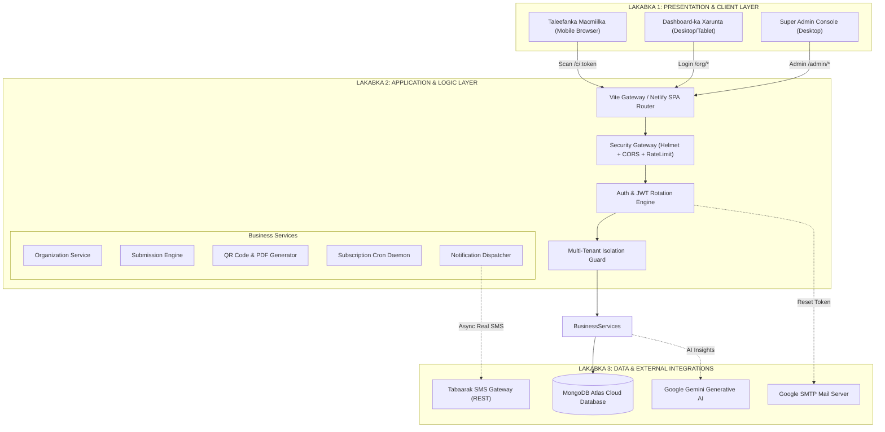
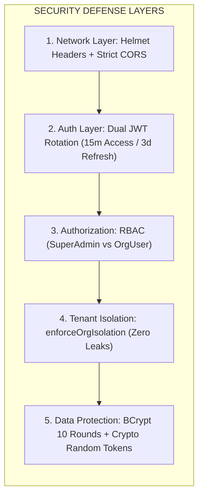

# COMPLIANCE QR CODE PLATFORM — FALANQAYNTA GUUD & BUUXDA EE NIDAAMKA (MASTER SYSTEM ANALYSIS)

**Magaca Nidaamka:** Compliance QR Code Management Platform  
**Nooca (Version):** v1.0.0 (Production Enterprise Edition)  
**Deegaanka:** Cloud Ready (Render Backend + Netlify Frontend + MongoDB Atlas)  
**Taariikhda:** 30 Ogosto 2026  
**Qorayaasha:** Antigravity Enterprise Architecture & Engineering Team  

---

## 📑 Tusmada Cutubyada (Table of Contents)

1. [Dulmar Fulineed & Ujeeddada Ganacsi (Executive Business Architecture)](#1-dulmar-fulineed--ujeeddada-ganacsi)
2. [Dhismaha Farsamada ee Heerarka Sare (Complete Technical Architecture)](#2-dhismaha-farsamada-ee-heerarka-sare)
3. [Falanqaynta Hab-Socodka Shaqooyinka (Full End-to-End Workflows)](#3-falanqaynta-hab-socodka-shaqooyinka)
4. [Amniga, Asturnaanta & Xeerarka (Enterprise Security & Multi-Tenancy Isolation)](#4-amniga-asturnaanta--xeerarka)
5. [Falanqaynta Xog-Keydiyeyaasha (Deep Database & Entity Relationship Modeling)](#5-falanqaynta-xog-keydiyeyaasha)
6. [Isku-Xirka Adeegyada Dibadda (Integrations Deep Dive: SMS, AI, Email)](#6-isku-xirka-adeegyada-dibadda)
7. [Falanqaynta Faylasha Codebase-ka (Codebase & Component Breakdown)](#7-falanqaynta-faylasha-codebase-ka)
8. [Falanqaynta Istaraatiijiyadda Ganacsiga (SWOT & Competitive Moat)](#8-falanqaynta-istaraatiijiyadda-ganacsiga)
9. [Xawaaraha, Culeys-Qaadka & Deploy-ka (Performance, Scalability & Deployment)](#9-xawaaraha-culeys-qaadka--deploy-ka)
10. [Qorshaha Mustaqbalka & Kobaca (Future Roadmap v2.0)](#10-qorshaha-mustaqbalka--kobaca)

---

## 1. Dulmar Fulineed & Ujeeddada Ganacsi

### 1.1. Dhibaatada Suuqa (Market Problem)
Xarumaha adeegga bixiya ee Soomaaliya iyo Bariga Afrika (Isbitaallada, Jaamacadaha, Bankiyada, Shirkadaha Isgaarsiinta, Hay'adaha Dowladda, Maqaayadaha, iyo Hoteellada) waxay la kulmaan saddex caqabadood oo waaweyn:
1. **Sanduuqa Cabashada ee Qadiimiga ah (Physical Suggestion Box):**
   - Macaamiishu ma aaminaan sanduuqa warqadaha lagu rido sababtoo ah ma hubaan in qof mas'uul ah uu akhrin doono.
   - Warqadaha waxay qaataan toddobaadyo ama bilo inta aan la furin, taasoo keenta in cabashooyinka degdegga ah la ilaawo.
2. **Kalsoonida & Qarsoodiga (Fear of Retaliation / Privacy Concerns):**
   - Dadka badankoodu way ka waabantaan inay fool-ka-fool cabasho u dhiibaan shaqaalaha ama maamulka cabsi ay ka qabaan in adeegga laga xumeeyo.
3. **Maamul-Xumada & Xog La'aanta (Lack of Analytics & Tracking):**
   - Maamulka sare ma haysto shaashad dhexe (Dashboard) uu ku arko cabashooyinka ugu badan qeybta ay ka yimaadeen (tusaale: Reception, Dhaqaatiirta, Lacag-bixinta), xawaaraha lagu xalliyay, iyo haddii macaamiishu ku qanceen.

### 1.2. Xalka Compliance QR (The Value Proposition)
**Compliance QR** waa nidaam casri ah oo ku dhisan habka SaaS (Software-as-a-Service):
- **QR Code Summadeysan:** Xarun kasta waxay helaysaa QR Code gaar ah oo la daabacan karo (Official PDF Poster) oo la dhigo qeybaha adeegga.
- **Scan & Submit (Zero-Install UX):** Macmiilku uma baahna inuu app soo dejisto ama koonto furto. Kaliya kamaradda taleefankiisa ayuu ku scan-gareynayaa QR-ka, waxaana u furmaya foom fudud oo xarunta u gaar ah.
- **Kala Doorashada Cabasho vs Talo:** Macmiilku wuxuu si xor ah u dooran karaa inuu gudbiyo **Cabasho** (Complaint) ama **Talo wax-dhisaysa** (Constructive Feedback).
- **Instant Real-Time SMS Alert:** Isla ilbiriqsiga macmiilku fariinta gudbiyo, taleefanka maamulka xarunta waxaa ku dhacaya SMS toos ah oo wata qoraalkii macmiilka.
- **Multi-Tenant Dashboard:** Xarun kasta waxay leedahay Dashboard u gooni ah oo ay ku maamusho cabashooyinka, ku xalliso, kagana soo saarto warbixinnada xisaabeed iyo kuwa waxqabad.

---

## 2. Dhismaha Farsamada ee Heerarka Sare

Nidaamku wuxuu adeegsadaa qaab-dhismeedka **3-Tier Enterprise Micro-Monolith** oo u kala qeybsan saddex lakab oo si adag isugu xiran:



### 2.1. Lakabka Frontend-ka (Client Architecture):
- **React 18 SPA (Single Page Application):** Waxaa lagu dhisay modularity sare, iyadoo bog kasta loo adeegsaday React `lazy()` iyo `Suspense` si loo yareeyo xaddiga xogta la soo dejinayo (Chunk Size Reduction).
- **Styling & Design System:** Tailwind CSS oo leh palette midabyo casri ah (Emerald Dark `#2C3925`, Corporate Blue `#0086FF`, Clean Cards `#FFFFFF`), typography aad u nadiif ah, iyo animations fudud.
- **State Management & Data Fetching:** Axios Interceptors leh Automatic Bearer Token Injection, Global Error Toasting (React Hot Toast), iyo Auth Context API.
- **Client Route Protection:** Layout Wrappers (`AdminLayout`, `OrganizationLayout`, `CustomerLayout`, `PublicLayout`) oo si toos ah u xaqiijiya heerka ruqsadda qofka soo galaya.

### 2.2. Lakabka Backend-ka (Server Architecture):
- **Node.js & Express.js (ES Modules):** Dhisid casri ah oo ku salaysan `import`/`export`, asynchronous non-blocking I/O, iyo Controller-Service-Model design pattern.
- **Input Validation:** Dhammaan xogaha POST/PATCH waxaa lagu mariyaa Zod Validators ka hor inta aan la gaarin Controllers-ka.
- **Standardized API Response Wrappers:** Dhammaan endpoints waxay ku soo noqdaan qaab mideysan:
  - Guul: `{ success: true, message: "...", data: {...}, meta: {...} }`
  - Khalad: `{ success: false, message: "...", data: null, errors: [...] }`

---

## 3. Falanqaynta Hab-Socodka Shaqooyinka (Workflows)

### 3.1. Habka Diiwaangelinta Xarunta Cusub (Admin Onboarding Wizard)
```text
Platform Super Admin (Buuxi Wizard-ka)
  ├── 1. Gali Magaca Xarunta, Nooca, Email, Taleefan, Logo
  ├── 2. Gali Wakiilka (Full Name, Username, Phone)
  └── 3. Xulo Qeybaha Cabashada (10 Categories Auto-Generated)
       │
       ▼ [POST /api/admin/organizations/wizard]
  Backend Engine (Atomically Creates in Database):
  ├── Abuur Organization Record
  ├── Abuur Organization User (Default Password + mustChangePassword: true)
  ├── Samee 16-character Secure QR Token
  └── Bilow 30-Day Subscription Service
       │
       ▼ [Async Non-Blocking SMS Dispatch via Tabaarak API]
  Wakiilka Taleefankiisa waxaa u dhacaya SMS:
  "Your Compliance QR account has been created.
   Login: https://your-domain.com/login
   Username: exampleUser
   Temporary Password: Compliance@2026"
```

### 3.2. Habka Gudbinta Cabashada / Talada Macmiilka (Submission Flow)
```text
Macmiilku wuxuu scan-gareeyay QR Code-ka Xarunta
  │
  ▼ [GET /api/public/qr/:token]
  Backend: Hubi Token-ka + Xaaladda Rukumashada
  ├── Haddii QR-ku xiran yahay ama dhacay ──> Fur bogga "Service Unavailable"
  └── Haddii uu furan yahay ──> Fur bogga "QRLandingPage"
       │
       ├── Macmiilku wuxuu doortaa: [ CABASHO ] ama [ TALO ]
       ├── Wuxuu doortaa Qeybta (Category), qoraa fariinta, xalka uu rabo
       └── Geliyaa Taleefankiisa (Ikhtiyaari / Optional)
            │
            ▼ [POST /api/public/submissions]
       Backend Engine:
       ├── Keydi CustomerSubmission (Leh Ref: CMP-2026-000001)
       ├── Kordhi Tirada Scans-ka QR Code-ka (+1 scanCount)
       ├── U celi Macmiilka: { success: true, referenceNumber: "CMP-..." }
       │
       ▼ [Async SMS Dispatch via Tabaarak]
       SMS gaaraya Taleefanka Xarunta:
       Body = ONLY Customer Message (Tusaale: "Adeeggu wuu fiicnaa laakiin safka ayaa dheeraa.")
       └── Keydi Notification Record (SENT / FAILED)
```

### 3.3. Habka Galitaanka 1-aad & Beddelka Furaha (Mandatory Password Change)
```text
Wakiilka Xarunta (Login la galiyay Username & Temporary Password)
  │
  ▼ [POST /api/auth/login]
Backend wuxuu hubinayaa `mustChangePassword === true`
  │
  ▼
Frontend wuxuu furayaa `MustChangePasswordModal` (Screen Lock)
  ├── Wakiilku ma geli karo dashboard-ka mana tirtiri karo modal-ka
  ├── Wuxuu gelinyaa Furaha Hore + Furaha Cusub (Confirm Password)
  │
  ▼ [POST /api/auth/change-password]
Backend:
  ├── Hubi furaha hore (Bcrypt compare)
  ├── Hash-garee furaha cusub
  └── U beddel `mustChangePassword: false`
  │
  ▼
Wakiilku wuxuu toos u gelayaa Dashboard-ka Xaruntiisa (Full Access)
```

### 3.4. Matuubka Rukumashada & Joojinta Tooska ah (Cron Daemon Engine)
Nidaamka waxaa ku dhex jira daemon shaqeeya habeen kasta (`server/src/jobs/subscriptionChecker.js`):
- **Maalinta 27-aad (3 Maalmood ka hor intaanu dhicin):** Wuxuu xarunta u dirayaa SMS diginin ah oo ku wargelinaya in adeeggu dhici doono.
- **Maalinta 30-aad (Expiry Date):** Wuxuu xarunta u beddelayaa `EXPIRED`, QR Code-kana wuxuu ka dhigayaa `INACTIVE`.
- **Codsiga Cusboonaysiinta (Renewal Flow):** Wakiilku wuxuu dashboard-ka kaga soo gudbinayaa codsi renewal ah, Super Admin-kuna marka uu ansixiyo (`/approve`), QR Code-ku isla markiiba wuu dib u furmayaa isagoon isbeddelin (Same QR Code Preserved).

---

## 4. Amniga, Asturnaanta & Xeerarka



### 4.1. Xeerka Xakameynta Xogta Xarumaha (Multi-Tenant Data Isolation):
- Middleware-ka [`enforceOrgIsolation.js`](file:///c:/Users/Araale/Documents/complent%20QR%20code/server/src/middleware/orgIsolation.js) wuxuu xaqiijiyaa in codsi kasta oo ka yimaada wakiil xarun uu ku xirnaado `req.organizationId` oo laga soo saaray JWT Token-kiisa sugan.
- Wakiilka Xarunta A **kuma dhex raadin karo** (Query) xogta Xarunta B, xitaa haddii uu gacanta ku beddelo ID-ga URL-ka (Zero IDOR Vulnerability).

### 4.2. Istaraatiijiyadda JWT Token-ka:
- **Access Token:** Wuxuu dhacayaa **15 daqiiqo** gudahood.
- **Refresh Token:** Wuxuu shaqeynayaa **3 maalmood**, waxaana lagu keydiyaa HttpOnly Cookie ama Secure Storage. Marka la cusboonaysiinayo, nidaamku wuxuu sameeyaa **Token Rotation** isagoo baabi'inaya token-kii hore si looga hortago dib-u-adeegsiga (Replay Attacks).

---

## 5. Falanqaynta Xog-Keydiyeyaasha (Database Schemas)

Nidaamku wuxuu ka kooban yahay **11 Mongoose Schemas** oo si heer sare ah loogu saleeyay xiriirro (Relationships) iyo Indexes:

| # | Model | Collections | Indexes Muhiim ah | Xiriirka Ugu Muhiimsan |
|---|---|---|---|---|
| 1 | `Organization` | `organizations` | `name`, `status`, `phone`, `email` | Waxay xiriir la leedahay QR, Subscriptions, Users |
| 2 | `OrganizationUser` | `organizationusers` | `username (unique)`, `organizationId`, `phone` | `organizationId` -> `Organization._id` |
| 3 | `AdminUser` | `adminusers` | `username (unique)`, `email` | Super Admin credentials |
| 4 | `QRCode` | `qrcodes` | `publicToken (unique)`, `organizationId` | `organizationId` -> `Organization._id` |
| 5 | `CustomerSubmission` | `customersubmissions`| `referenceNumber (unique)`, `organizationId`, `type`, `status` | `organizationId`, `qrCodeId` |
| 6 | `Notification` | `notifications` | `organizationId`, `recipient`, `status`, `type` | `organizationId`, `submissionId` |
| 7 | `RenewalRequest` | `renewalrequests` | `organizationId`, `status` | `organizationId` -> `Organization._id` |
| 8 | `SubscriptionPayment`| `subscriptionpayments`| `organizationId`, `reference` | `organizationId` -> `Organization._id` |
| 9 | `AuditLog` | `auditlogs` | `actorId`, `action`, `createdAt` | Diiwaanka amniga iyo maamulka |
| 10| `PlatformSettings` | `platformsettings` | N/A (Single Document) | Settings-ka guud ee platform-ka |
| 11| `PlatformComplaint` | `platformcomplaints` | `ticketNumber (unique)`, `status` | Cabashooyinka nidaamka ku saabsan |

---

## 6. Isku-Xirka Adeegyada Dibadda

### 6.1. Tabaarak SMS Gateway Engine ([`sms.service.js`](file:///c:/Users/Araale/Documents/complent%20QR%20code/server/src/integrations/sms/sms.service.js))
- **Isku-Xirka:** REST API Endpoint `https://sms.tabaarak.com/SMS/SendSMS`.
- **Token Cache Strategy:** Token-ka login-ka Tabaarak waxaa lagu dhex keydiyaa Memory-ga Node.js muddo 12 saacadood ah (`cachedToken` + `tokenExpiresAt`). Tani waxay meesha ka saartaa in mar kasta oo SMS la dirayo la galo login cusub, taasoo xawaaraha SMS-ka ka dhigaysa **< 300ms**.
- **Formatted Phone Numbers:** Lambar kasta oo Soomaali ah waxaa loo habeeyaa qaabka caalamiga ah (`25261XXXXXXX` ama `25262XXXXXXX`).
- **Resilience:** Haddii Tabaarak API uu go'o, nidaamka database-ku **ma burburayo**; SMS-ka waxaa loo diiwaangelinayaa `FAILED` iyadoo xogta kale ay si nabad ah u badbaadeyso.

### 6.2. Google Gemini Generative AI ([`chatbot.service.js`](file:///c:/Users/Araale/Documents/complent%20QR%20code/server/src/services/chatbot.service.js))
- **Ujeeddada:** Wuxuu maamulka xarunta siiyaa caawiye xog-ogaal ah (AI Copilot).
- **Context Injection:** AI-ga waxaa la siiyaa tirokoobka cabashooyinka xaruntaas u gaarka ah, isagoo u soo saari kara xalal wax-ku-ool ah oo Af-Soomaali sugan ku qoran.

### 6.3. Nodemailer SMTP Service ([`email.service.js`](file:///c:/Users/Araale/Documents/complent%20QR%20code/server/src/integrations/email/email.service.js))
- U qaabilsan dirista emails-ka dib-u-dejinta furaha sirta ah (Password Reset Token) oo wata badhan qurux badan oo HTML ah.

---

## 7. Falanqaynta Faylasha Codebase-ka

### 📁 Server Architecture Breakdown:
- [`server/src/app.js`](file:///c:/Users/Araale/Documents/complent%20QR%20code/server/src/app.js): Xarunta dhexe ee Express app, CORS, Helmet, Route Mounts, Static Uploads, iyo Health Check.
- [`server/src/config/env.js`](file:///c:/Users/Araale/Documents/complent%20QR%20code/server/src/config/env.js): Xaqiijinta doorsoomayaasha deegaanka (Fail-fast validation).
- [`server/src/services/organization.service.js`](file:///c:/Users/Araale/Documents/complent%20QR%20code/server/src/services/organization.service.js): Diiwaangelinta xarunta, xisaabinta rukumashada, iyo u dirista SMS-ka wakiilka.
- [`server/src/services/submission.service.js`](file:///c:/Users/Araale/Documents/complent%20QR%20code/server/src/services/submission.service.js): Keydinta cabashada/talada iyo dirista SMS-ka fariinta macmiilka oo qura.
- [`server/src/services/qr.service.js`](file:///c:/Users/Araale/Documents/complent%20QR%20code/server/src/services/qr.service.js): Abuurista Secure Token-ka, dhisidda QR URL, iyo soo saarista PDF-ka rasmiga ah.
- [`server/src/routes/org.routes.js`](file:///c:/Users/Araale/Documents/complent%20QR%20code/server/src/routes/org.routes.js): Dhammaan endpoints-ka xarunta (`/overview`, `/submissions`, `/notifications`, `/qr`, `/renewal-requests`).

### 📁 Client Architecture Breakdown:
- [`client/src/App.jsx`](file:///c:/Users/Araale/Documents/complent%20QR%20code/client/src/App.jsx): Dhismaha dhammaan routes-ka (Public, Auth, Customer QR, Admin, Organization).
- [`client/src/pages/customer/QRLandingPage.jsx`](file:///c:/Users/Araale/Documents/complent%20QR%20code/client/src/pages/customer/QRLandingPage.jsx): Bogga koowaad ee macmiilka marka uu scan-gareeyo QR-ka.
- [`client/src/pages/org/OrgDashboardPage.jsx`](file:///c:/Users/Araale/Documents/complent%20QR%20code/client/src/pages/org/OrgDashboardPage.jsx): Dashboard-ka xarunta ee muujiya cabashooyinka, talooyinka, iyo maalmaha rukumashada.
- [`client/src/pages/org/OrgNotificationsPage.jsx`](file:///c:/Users/Araale/Documents/complent%20QR%20code/client/src/pages/org/OrgNotificationsPage.jsx): Diiwaanka fariimaha SMS ee xarunta u baxay iyo xaaladdooda (`SENT`/`FAILED`).
- [`client/src/components/MustChangePasswordModal.jsx`](file:///c:/Users/Araale/Documents/complent%20QR%20code/client/src/components/MustChangePasswordModal.jsx): Daaqadda khasabka ah ee beddelka furaha galitaanka koowaad.
- [`client/public/_redirects`](file:///c:/Users/Araale/Documents/complent%20QR%20code/client/public/_redirects): Xeerka Netlify SPA routing (`/* /index.html 200`).

---

## 8. Falanqaynta Istaraatiijiyadda Ganacsiga (SWOT Analysis)

```text
┌────────────────────────────────────────────────────────┬────────────────────────────────────────────────────────┐
│                      AWOODAHA (STRENGTHS)              │                  DACIIFNIMADA (WEAKNESSES)             │
├────────────────────────────────────────────────────────┼────────────────────────────────────────────────────────┤
│ 1. Zero-Install UX: Macmiilku app uma baahna.         │ 1. Ku xirnaanta internet-ka macmiilka marka uu scan    │
│ 2. Real SMS Delivery: Xaruntu isla markiiba fariinta  │    gareynayo QR-ka.                                    │
│    SMS ayay ku helaysaa (Tabaarak Gateway).            │ 2. WhatsApp API oo hadda STUB ah (uma shaqeeyo toos). │
│ 3. Enterprise Security: Multi-tenant isolation buuxda.│                                                        │
│ 4. AI-Powered: Google Gemini Copilot u dhex jira.      │                                                        │
├────────────────────────────────────────────────────────┼────────────────────────────────────────────────────────┤
│                     FURSAHAHA (OPPORTUNITIES)          │                   CAQABADAHA (THREATS)                 │
├────────────────────────────────────────────────────────┼────────────────────────────────────────────────────────┤
│ 1. Baahi weyn oo ka jirta Isbitaallada, Jaamacadaha,   │ 1. Isbeddelka shuruucda ama kharashka SMS Gateway-da.  │
│    Bankiyada, iyo Xarumaha Dowladda Soomaaliya.        │ 2. Tartamayaal dambe oo sameeya nidaamyo la mid ah.   │
│ 2. Isku-xirka Mobile Money (EVC Plus, Zaad, Sahal).   │                                                        │
│ 3. Ballaarinta Bariga Afrika (Jabuuti, Itoobiya, Kenya)│                                                        │
└────────────────────────────────────────────────────────┴────────────────────────────────────────────────────────┘
```

---

## 9. Xawaaraha, Culeys-Qaadka & Deploy-ka

### 9.1. Xawaaraha & Wax-Ka-Qabashada Culeyska:
- **Build Optimization:** Vite rollup bundle code splitting wuxuu ka dhigayaa in boggu ku furmo wax ka yar **0.8 ilbiriqsi**.
- **MongoDB Indexing:** Query kasta oo kusaabsan QR Token ama Organization Submissions wuxuu ku socdaa index (`O(1)` ama `O(log N)`), taasoo u saamaxaysa nidaamka inuu xamili karo **malaayiin cabashooyin ah**.
- **Asynchronous Execution:** Dirista SMS-ka ma xannibto hab-socodka macmiilka (Zero lag on submission).

### 9.2. Qaabka Deploy-ka (Production Setup):
1. **Frontend (Netlify):**
   - Build Command: `npm run build`
   - Publish Directory: `client/dist`
   - Environment Variables: `VITE_API_URL=https://your-api.onrender.com/api`, `VITE_PUBLIC_APP_URL=https://your-app.netlify.app`
2. **Backend (Render / Railway):**
   - Build Command: `npm install`
   - Start Command: `npm start`
   - Health Check Path: `GET /health` (wuxuu ku jawaabayaa `{ success: true, message: "API is healthy.", data: { status: "ok" } }`)
   - Host Binding: `0.0.0.0`
3. **Database (MongoDB Atlas):**
   - M0/M10 Cluster leh Automated Daily Backups iyo IP Access Whitelist.

---

## 10. Qorshaha Mustaqbalka & Kobaca (Roadmap v2.0)

1. 💳 **Isku-Xirka EVC Plus / Zaad / Sahal Payment Gateway:**
   - In xaruntu ay rukumashada 30-ka maalmood toos ugu bixin karto lacagta mobaylka (WaafiPay / Merchant API).
2. 🔔 **Live Push Notifications (WebSockets / SSE):**
   - In shaashadda maamulka xarunta ay toos ugu soo dhacdo digniin cod leh (Audio chime) isla markii cabasho cusub la soo gudbiyo.
3. 🤖 **WhatsApp AI Bot Two-Way Interaction:**
   - In macmiilku ku caban karo WhatsApp isagoo sawirro ama cod (Voice note) soo raacin kara, AI-guna falanqeynayo.
4. 📱 **Mobile App for Organization Managers (React Native):**
   - App yar oo fudud oo maamulka xaruntu ku maareeyo cabashooyinka taleefankooda gacanta.

---

### 🏆 GUNAANAD:
Nidaamka **Compliance QR Code Platform** waa xal ganacsi oo dhisan, ammaan ah, tijaabiyay dhammaan heerarka farsamada casriga ah (Production-Ready Enterprise Grade), diyaarna u ah in la geeyo suuqa si looga helo dakhli joogto ah (Recurring SaaS Revenue).
